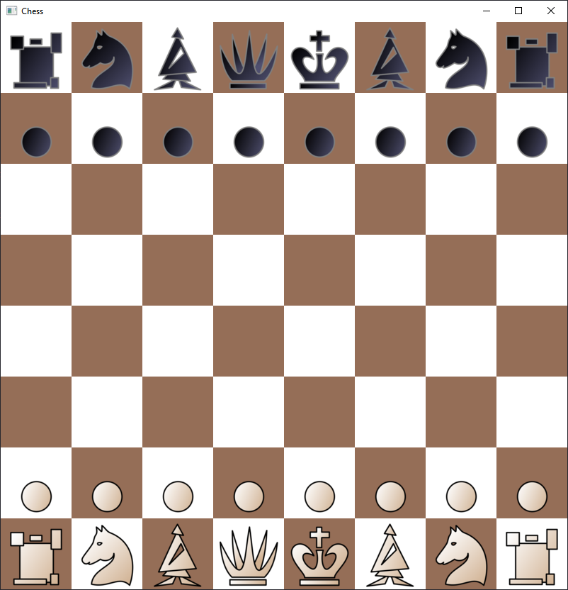
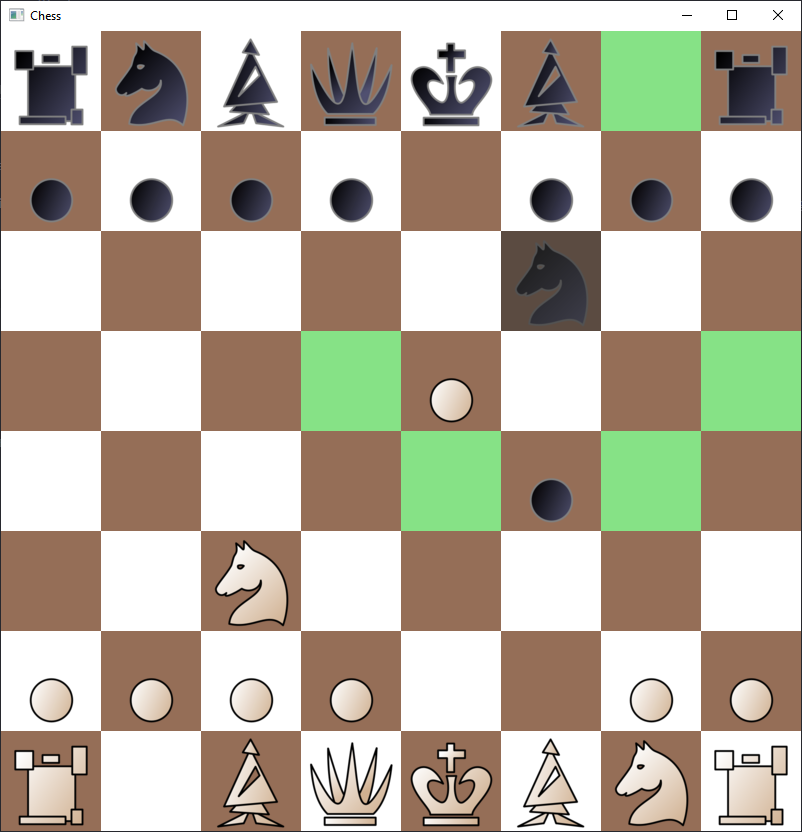
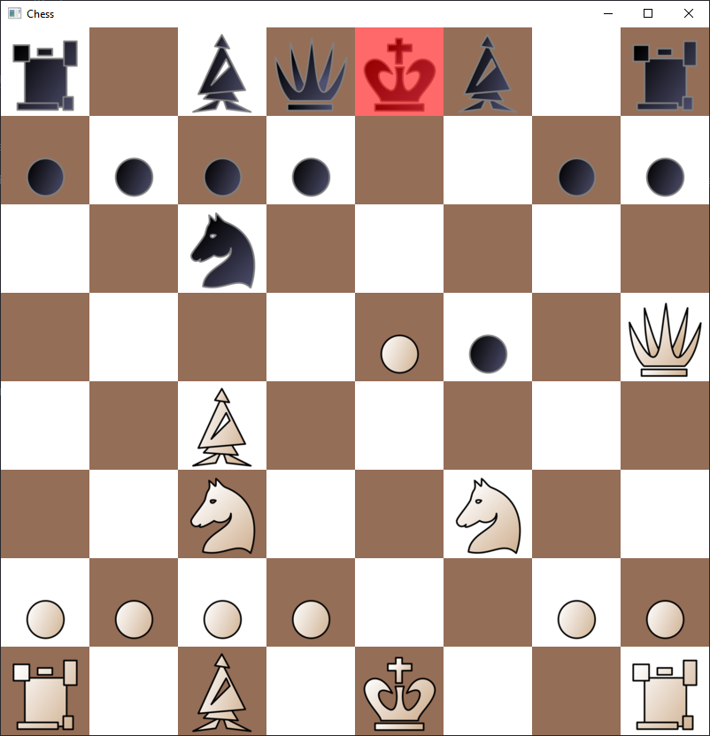
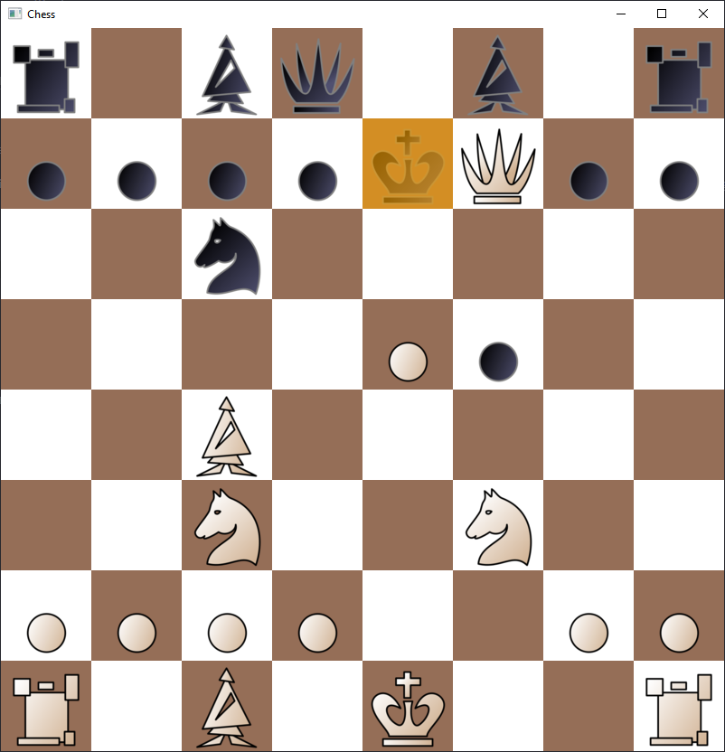

# Chess

Chess client written in C++.



## Requirements
- C++17
- SFML 2.5.1
- 64-bit CPU and operating system
- Windows (g++), macOS (clang++), Linux (g++)

## Setup
Clone the repository.
   ```
   git clone https://github.com/TheToasterMonster/chess.git
   ```
Open the project with Visual Studio Code (VSCode).

If Windows, make sure SFML files are located at `C:\Dev\Libraries`.

Run build task (`CTRL SHIFT B` in Windows or `CMD SHIFT B` in macOS) in VSCode, choose "build" (NOT "debug") configuration for corresponding operating system.

Run generated executable.

## Credits
Piece icons from [Wikimedia Commons (SVG chess pieces/Maurizio Monge)](https://commons.wikimedia.org/wiki/Category:SVG_chess_pieces/Maurizio_Monge)

## Screenshots


